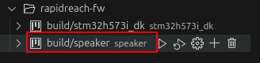

# RapidReach

## Project Overview

RapidReach is a system consisting of two modules: **Speaker** and **I/O Module**. These devices are centrally controlled via a network and provide functionality for warning systems and remote control operations.

### Speaker

The Speaker module functions as a warning system, receiving and playing audio files on command from a control server. The module supports data transmission via LTE mobile networks, wired Ethernet, and wireless WiFi. It is powered by mains electricity and includes a built-in battery for backup operation.

### I/O Module

The I/O Module enables remote and programmable control of four outputs and logical monitoring of four inputs. It operates via LTE mobile networks, wired Ethernet, and wireless WiFi. The device is powered by a 24V DC power source.

## Features

### Speaker

- **Audio Player Module**: Provides API for managing audio files:
    - Save, delete, and list audio files
    - Play and stop audio files
- **OPUS Decoder**: Decodes OPUS data to a raw audio stream (Zephyr-compatible)
- **Codec Driver**: Configures the audio amplifier and transfers audio data
- **Microphone Module**: Detects sound output presence
- **Battery Module**: Monitors battery parameters
- **Charger Module**: Control charging and get power status
- **LED Module**: Controls the LED indicator state
- **CLI Module**:
    - Implements a command-line interface via serial connection (UART, 115200 baudrate)
    - Supports custom commands, history, and log messages
- **DFU Application**: Supports firmware updates from a server or memory
- **Watchdog Module**: Prevents device malfunction by resetting an external watchdog timer
- **Device Info Module**: Handles device identification, including hardware and software versions, and board-specific IDs
- **RTC Module**: Reads and updates the real-time clock (RTC)
- **LittleFS File System**: Manages storage and file operations for audio data
- **Button And Switch Modules**: Handles GPIO input and interrupt processing for switches and the power button 
- **Ethernet Module**: Manages Ethernet interface
- **Wi-Fi Module**: Manages the Wi-Fi interface, connects to access points, scans available networks, saves networks
- **LTE Module**: Manages the cellular modem (PPP interface), including initialization and connection
- **HTTP Module**: Implements HTTP GET, POST requests and downloading firmware and audio files
- **Reference Application**: Simplified top-level software implementation

### I/O Module

- **ESPA 444 Module**: Provides API for data exchange on RS-485 using ESPA 444 protocol
- **RS-485 Driver**: Controls the RS-485 transceiver module
- **Relay Module**: Controls relay outputs
- **Input Module**: Reads digital input states
- **LED Driver**: Controls the LED indicator state
- **CLI Module**:
    - Implements a command-line interface via serial connection
    - Supports custom commands, history, and log messages
- **DFU Application**: Supports firmware updates from a server or memory
- **Watchdog Driver**: Prevents device malfunction by resetting an external watchdog timer
- **Reference Application**: Simplified top-level software implementation

## Hardware

- **MCU**: STM32H573VI
- **WiFi**: nRF7002
- **Ethernet**: LAN8742A
- **Power Management**: LV2862YD, TPS563300DR
- **Flash Memory**: IS25LP032D
- **LTE Modem**: Cavli CS16QS-WW-GNAN

## Software

The project is built using the following tools and frameworks:

- **Zephyr RTOS**: Version 4.0.0
- **Zephyr SDK Version**: 0.17.0
- **IDE**: Visual Studio Code (VSCode) with:
    - **Zephyr IDE**: Setup, build, flashing, and debugging of Zephyr projects
    - **Cortex-Debug**: ARM Cortex-M GDB Debugger support
    - **C/C++**: IntelliSense, debugging, and code browsing
    - **Serial Monitor**: Text communication via serial ports
    - **nRF DeviceTree**: Full DeviceTree language support for the Zephyr project
    - **nRF Kconfig**: Kconfig language support for the Zephyr Project
    - **CMake**: CMake langage support for Visual Studio Code
- **stlink-gdb-server**: GDB server
- **cubeprogrammer**: STM32 programming 

## Getting Started

### Prerequisites

1. Install dependencies: [Zephyr Project Guide](https://docs.zephyrproject.org/latest/develop/getting_started/index.html#install-dependencies)

2. Install required extensions in VSCode:

    - Zephyr IDE
    - Cortex-Debug
    - C/C++

3. After installing **Zephyr IDE**, go to **EXTENSION SETUP**, section and follow the steps below (refer to the image):

    1. Click **Zephyr IDE** in the left panel  
    2. Click **Check Build Dependencies**  
    3. Click **Setup West Environment**  
    4. Click **Install SDK**
    5. Click **West Update**

    

4. Fetch Wi-Fi blobs for the nRF70 module:

    - Open the **Command Palette** 
    - Select **Run Task**  
    - Choose **Fetch Wi-Fi nRF70 blobs**

    

    

5. Install [STM32CubeProgrammer](https://www.st.com/en/development-tools/stm32cubeprog.html)

6. Install [STM32CubeIDE](https://www.st.com/en/development-tools/stm32cubeide.html)


### Building the Project

1. Open the project in **VSCode**.
2. Select the target board (e.g. `speaker`) using the **Zephyr IDE** extension
3. Build the project using the selected configuration.

    

    


### Flashing the Device

1. Connect the hardware to your development environment.
2. Use the **Zephyr IDE extension** and **STM32CubeProgrammer** to flash the firmware onto the MCU.

    

### Debugging

1. Before starting debugging for the first time, сreate a symbolic link for `arm-none-eabi-gdb`:
   ```sh
   sudo ln -s /usr/bin/gdb-multiarch /usr/bin/arm-none-eabi-gdb
   ```
2. Before starting debugging, verify the paths for **ST-LINK GDB Server** and **STM32CubeProgrammer** in `tasks.json`.

3. Press `F5` in VSCode to start debugging (ensure the firmware is built before running).

    

### Documentation

Refer to the [Zephyr IDE Setup Guide](https://github.com/mylonics/zephyr-ide/blob/main/docs/MANUAL.md) for detailed installation instructions.

## Project Configuration

During development and debugging, you can configure the project using **menuconfig** or **guiconfig**.
(The Zephyr IDE terminal is recommended to be used)

- To open the configuration menu in the terminal:
  ```sh
  west build -t menuconfig
  ```
- To open the graphical configuration menu:
  ```sh
  west build -t guiconfig
  ```

- To open the configuration menu directly from **VSCode** in **Zephyr IDE**, click the **gear icon** next to the **Build** command as shown below:

    
    

In the configuration menu, under the **"RapidReach Modules"** section, you can:

- Enable or disable specific modules.

- Set parameters for modules, such as log levels, and other configurations.

    

### Persistent Configuration

- To make configuration changes permanent for the project, use the `prj.conf` file or board overlay.
- All RapidReach project configuration options start with the prefix:
  ```
  CONFIG_RPR_*
  ```

> ⚠️ **Important:**
> Some modules are dependencies for others (e.g. CLI). When disabling modules, ensure that no conflicts or missing dependencies are introduced into the project.

## Project Structure

This section describes the structure of the `rapidreach-fw` firmware project. Only key folders and files are listed, each with a short explanation of its purpose.

```sh
rapidreach-fw
    ├── .vscode
    │   └── ...                     # VSCode workspace configuration files
    ├── .west
    │   └── ...                     # West manifest management files
    ├── boards
    │   ├── alnicko
    │   │   └── speaker             # Custom board definition for the Alnicko Speaker device
    │   │       └── ...             # Device Tree and board-specific files
    │   └── ...                     # Overlay and configuration files
    ├── CMakeLists.txt              # Main CMake build script for the entire project
    ├── doc
    │   └── ...                     # Project documentation and development notes
    ├── drivers
    │   ├── c16qs
    │   │   └── ...                 # Cavli C16QS modem driver implementation
    │   ├── CMakeLists.txt          # CMake definitions for driver compilation
    │   ├── cs43l22
    │   │   └── ...                 # Driver for CS43L22 codec (used for OPUS tests on dev boards)
    │   ├── Kconfig                 # Driver configuration menu entries
    │   └── zephyr
    │       └── ...                 # Required for Zephyr's module.yml integration
    ├── dts
    │   └── bindings
    │       └── ...                 # Custom devicetree bindings for hardware components
    ├── Kconfig                     # Top-level Kconfig for enabling project modules
    ├── prj.conf                    # Main project configuration file
    ├── README.md                   # This documentation file
    ├── script
    │   └── generate_updates.py     # Script to generate update (.bin)
    ├── src
    │   ├── audio_player
    │   │   └── ...                 # Audio playback module (OPUS, I2S + audio control)
    │   ├── battery
    │   │   └── ...                 # Battery measurement and monitoring logic
    │   ├── charger
    │   │   └── ...                 # Charger control and power detection
    │   ├── cli
    │   │   └── ...                 # Shell command-line interface implementation
    │   ├── CMakeLists.txt          # Lists all source modules for build
    │   ├── dev_info
    │   │   └── ...                 # Device ID, hardware version, firmware version handling
    │   ├── dfu_manager
    │   │   └── ...                 # Firmware update manager
    │   ├── ethernet
    │   │   └── ...                 # Ethernet interface control module
    │   ├── examples
    │   │   └── ...                 # Demo applications showcasing module usage
    │   ├── file_manager
    │   │   └── ...                 # FLASH and LittleFS File System module 
    │   ├── http_module
    │   │   └── ...                 # HTTP client implementation (GET/POST, audio/firmware download)
    │   ├── Kconfig.rapidreach      # Module-specific Kconfig for enabling features
    │   ├── led_control
    │   │   └── ...                 # LED control module 
    │   ├── main
    │   │   └── main.c              # Application entry point and main logic
    │   ├── microphone
    │   │   └── ...                 # Microphone and sound presence detection
    │   ├── modem
    │   │   └── ...                 # LTE modem (PPP) configuration and control
    │   ├── poweroff
    │   │   └── ...                 # Poweroff mechanism and button event handling
    │   ├── rtc
    │   │   └── ...                 # RTC (Real-Time Clock) set/get support
    │   ├── switch_module
    │   │   └── ...                 # Module for switch handling via GPIO
    │   ├── system_watchdog
    │   │   └── ...                 # Internal watchdog (STM32_IWDG) module   
    │   ├── watchdog
    │   │   └── ...                 # External watchdog module
    │   └── wifi
    │       └── ...                 # Wi-Fi connection, scanning, and status
    ├── sysbuild                    # Sysbuild configuration (used for MCUboot + app builds)
    │   └── ...
    ├── sysbuild.conf               # Global sysbuild configuration for bootloader and app
    ├── VERSION                     # Project version file
    ├── west-manifest
    │   └── west.yml                # West manifest specifying project dependencies
    ├── .gitignore                  # Git ignore rules
    └── .clang-format               # Clang format rules for consistent code styling
```

## CLI Commands

This firmware uses the Zephyr Shell subsystem to provide a CLI interface via UART (baudrate: **115200**). To interact with the CLI, open a serial terminal and enter:

```sh
rapidreach
```

Below is a full list of available commands and their structure:

```sh
rapidreach                              # Root command for accessing all subsystems
├── led                                 # LED control commands
│   ├── on <index>                      # Turn on LED by index
│   ├── off <index>                     # Turn off LED by index
│   └── blink <index> <on_ms> <off_ms>  # Blink LED 
├── watchdog                            # Watchdog management
│   ├── enable                          # Enable watchdog
│   ├── disable                         # Disable watchdog
│   ├── feed                            # Feed the watchdog manually
│   └── demo                            # Watchdog demonstration
│       ├── feeding                     # Demonstration of watchdog feeding during work
│       └── freeze                      # Demonstration of system freeze triggering watchdog
├── microphone                          # Check microphone activity
├── charger                             # Battery charger control
│   ├── enable                          # Enable charger
│   ├── disable                         # Disable charger
│   └── status                          # Get charger status
├── battery                             # Read battery voltage and level
├── net                                 # Internet controls
│   ├── modem                           # Cavli C16QS modem interface
│   │   ├── init                        # Initialize and connect modem
│   │   ├── poweroff                    # Disconnect and power down modem
│   │   ├── reset                       # Restart the modem
│   │   ├── status                      # Check if modem is initialized
│   │   ├── info                        # Print modem information (IMEI, ICCID, etc.)
│   │   ├── rssi                        # Read modem signal strength
│   │   └── default                     # Modem interface control
│   │       ├── get                     # Check if modem is the default interface
│   │       └── set                     # Set modem as the default interface
│   ├── ethernet                        # Ethernet interface management
│   │   └── default                     # Ethernet interface control
│   │       ├── get                     # Check if ethernet is the default interface
│   │       └── set                     # Set ethernet as the default interface
│   ├── wifi                            # Wi-Fi interface commands
│   │   ├── scan                        # Start Wi-Fi scan
│   │   ├── connect[ssid][pass][band]   # Connect use provided params; use defaults or autoconnect if missing
│   │   ├── disconnect                  # Disconnect Wi-Fi
│   │   ├── info                        # Wi-Fi info"
│   │   ├── save                        # Save current network
│   │   ├── saved                       # Manage saved networks"
│   │   │   ├── show                    # Show saved networks
│   │   │   └── delete <index|all>      # Delete saved network by index or all networks
│   │   └── default                     # Wi-Fi interface control
│   │       ├── get                     # Check if Wi-Fi is the default interface
│   │       └── set                     # Set Wi-Fi as the default interface
│   └── http                            # HTTP client commands
│       ├── download                    # Download file via HTTP
│       │   ├── audio <url>             # Download an audio file from URL
│       │   └── update <url>            # Download and flash a firmware image
│       ├── get <url>                   # GET request and print response
│       └── post <url> <payload>        # POST request
├── info                                # Print fw version, hw revision and divece id
├── audio                               # Audio player commands
│   ├── playlist                        # Manage audio playlist
│   │   ├── show                        # Show list of audio files
│   │   └── delete <index|all>          # Delete audio file by index or all
│   ├── play <index>                    # Play audio by index
│   ├── stop                            # Stop audio playback
│   ├── pause                           # Toggle pause/resume
│   ├── info                            # Show audio status (volume, mute, state)
│   ├── reset                           # Restart the audio codec via GPIO
│   ├── ping                            # Ping the audio thread verify it
│   └── set                             # Audio settings
│       ├── volume <level>              # Set volume level
│       ├── mute                        # Enable mute
│       └── unmute                      # Disable mute
├── switch <index>                      # Read switch state by index (0–3)
├── dfu                                 # DFU management commands
│   ├── version                         # Show firmware update version from DFU slot
│   ├── confirm                         # Manage image confirmation
│   │   ├── mark                        # Mark the currently running image as confirmed
│   │   └── check                       # Check if the currently running image is confirmed
│   ├── upgrade                         # Request upgrade from the DFU image slot
│   │   ├── once                        # Run image once, then confirm or revert on next boot
│   │   └── permanent                   # Run and automatically confirm image 
│   └── integrity                       # Show result of the last image integrity check
└── poweroff                            # Simulate system shutdown (trigger poweroff GPIO)
```
## Firmware Update Generation

This project includes a script to generate updated firmware to use DFU.

To use it:

1. **Perform a full pristine build** of the firmware via Zephyr IDE.
2. Open the **Command Palette** and select **Tasks** in VSCode.
3. Select and run the task **"Generate Firmware Updates"**.

Upon successful execution, the output firmware update binary will be placed in the `firmware_updates/` directory.


## Example Application

The project includes two reference applications that demonstrate interaction with firmware modules. A test server is also provided for full demonstration and interaction.

**Test server:** [[link to server](http://209.38.240.207/)]

**Login:** *rapidreach*

**Password:** *rapidpass*

### Example Descriptions:

#### 1. Main Example

This example demonstrates integration of all firmware modules. It performs the following:

* Selects the active network interface
* Connects to the network
* Downloads necessary audio files from the server
* Posts logs to the server
* Updates the RTC time from the server
* Waits for a button press and plays an audio file
* Uses the microphone to confirm that playback occurred

It also includes a *supervisor thread* that monitors power, battery state, and pings other threads to feed the watchdog.

To enable this example, set the following configuration:

```conf
CONFIG_EXAMPLES_ENABLE_MAIN_EXAMPLES=y
```

#### 2. Alnicko Server Shell Example

This example provides a shell interface to interact with the server using simple commands.
To enable this example, set:

```conf
CONFIG_EXAMPLES_ENABLE_ALNICKO_SHELL=y
```

The shell root command is `alnicko` and includes the following subcommands (network connection is required):

```sh
alnicko                                # Root command for Alnicko server operations
├── time                               # Time-related operations
│   ├── get                            # Get time from the server
│   └── update                         # Update RTC time from the server
├── audio                              # Audio file management
│   ├── list                           # List available audio files on the server
│   └── get                            # Download audio files
│       ├── name <filename>            # Download audio file by name
│       └── num <index>                # Download audio file by index
├── update                             # Firmware update operations
│   ├── name                           # Get latest firmware filename from server
│   └── get                            # Download the latest firmware update
└── post <message>                     # Send a message to the server via HTTP POST
```

All example-related configuration options begin with the prefix:

```conf
CONFIG_EXAMPLES_*
```

## Troubleshooting

### Filesystem Not Accessible

If the filesystem commands (`fs ls`, `fs read`, etc.) are not working, the LittleFS filesystem may not be mounted. To fix this:

1. Mount the filesystem manually:
   ```bash
   # Via MQTT terminal
   mqtt-terminal -d "313938-shell" -c "fs mount littlefs /lfs" -q
   
   # Or via serial console
   fs mount littlefs /lfs
   ```

2. Verify the mount was successful:
   ```bash
   fs ls /lfs
   ```

3. Check filesystem status:
   ```bash
   fs statvfs /lfs
   ```

The filesystem should automatically mount on boot, but if it crashes or fails to mount, the above commands will restore access. All files are stored under `/lfs/` including:
- `/lfs/audio/` - Audio files (Opus format)
- `/lfs/wifi/` - WiFi configuration
- `/lfs/http_logs.bin` - HTTP log storage

## Documentation

- [Zephyr Documentation](https://docs.zephyrproject.org/)
- [Zephyr IDE](https://marketplace.visualstudio.com/items?itemName=mylonics.zephyr-ide)

